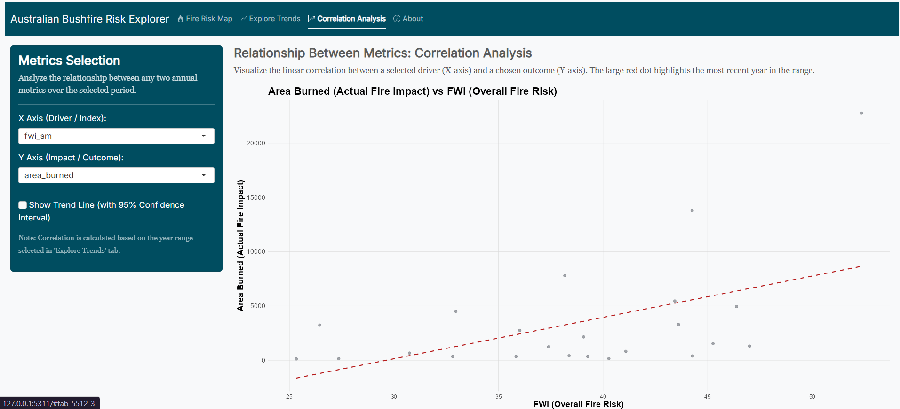

```{r, include = FALSE}
knitr::opts_chunk$set(
  collapse = TRUE,
  comment = "#>"
)
```

```{r setup}
library(ausbushfire)
```

## Overview

The `ausbushfire` R package provides an interactive interface to explore key fire weather indices and climate drivers in Southeastern Australia from **1979 to 2019**, analyzing trends related to the Black Summer bushfires.

**Key Features**

- Browse fire weather index (FWI) and burned area on a map (with slider for year),
- Explore trends in metrics like FWI, MSR, Tmax, Precip, IOD, SAM, Area Burned (with filters),
- View relationships between metrics in scatter plots.

## Installation

You can install the development version of `ausbushfire` directly from [GitHub](https://github.com/) using the remotes package.

```{r, eval=FALSE}
# Install remotes if needed
install.packages("remotes") 

remotes::install_github("ETC5523-2025/assignment-4-packages-and-shiny-apps-Jessica19940828")

```

## Launch the Shiny Application

The interactive explorer lives under inst/app/. Launch it with the exported function:
```{r, eval = FALSE}
library(ausbushfire)
ausbushfire::run_app()

```


## Package Data

The package `ausbushfire` ships one compact dataset:

- ausbushfire_data - Southeastern Australia annual data by fire season key metrics (FWI, MSR, Tmax, Precip, IOD, SAM, burned area) from 1979-2020.

See the full schema in the [Data dictionary](articles/data_dictionary.html) and see worked examples of data usage in the [Introduction to ausbushfire](articles/intro_to_ausbushfire.html)

You can load the package and inspect the data:


## App Tour: Interpreting Outputs

#### Fire Risk Map

Select Year with slider to show map opacity based on burned area, and update the fire risk (FWI) and actual impact (Burned Area) relative to the long-term historical context.
  

```{r}
#| echo: false
#| out.width: "80%"
#| fig.align: "center"
#| fig.cap: "Example - Risk Map: opacity changes with year slider, popup shows FWI and burned area."
#| fig.alt: "Interactive map with red region intensity for burned area; popup with details."
#| out.extra: 'class="img-frame"'
knitr::include_graphics("figures/risk_map.png")
```

```{r echo=FALSE, message=FALSE}
library(knitr)
library(kableExtra)

table_data <- data.frame(
  Component = c(
    "Select Year Slider",
    "FWI Value Box",
    "Burned Area Value Box"
  ),
  Description_of_Field = c(
    "Chooses the fire season year (ending year). Data is available from 1997 to 2018 for burned area.",
    "Shows the Fire Weather Index (FWI) for the selected year and the long-term average (1979–2019).",
    "Shows the Total Burned Area ($\\text{km}^2$) for the selected year."
  ),
  Interpretation_of_Output = c(
    "Use to visualize historical extremes. Dragging the slider allowing visual comparison of the extent of the burn area.",
    "If the box is **RED**, the FWI is significantly above the long-term average, indicating exceptionally dangerous fire weather conditions. If **ORANGE**, the risk is below or near average.",
    "The intensity of the red filling on the map directly reflects this area value. Higher opacity/intensity means a more devastating fire season."
  )
)

kable(table_data, format = "html", escape = FALSE,
      col.names = c("Component", "Description of Field", "Interpretation of Output")) %>%
  kable_styling(full_width = FALSE, bootstrap_options = c("striped", "hover", "condensed")) %>%
  column_spec(1, bold = TRUE, width = "15em") %>%
  column_spec(2, width = "25em") %>%
  column_spec(3, width = "35em")

```


#### Explore Trends

Filter Year Range and Metrics to see the volatility of climate metrics over time.

```{r}
#| echo: false
#| out.width: "80%"
#| fig.align: "center"
#| fig.cap: "Example: Time Series shows standardized metrics over time with trend line."
#| fig.alt: "Line chart of selected metrics with confidence intervals."
#| out.extra: 'class="img-frame"'
knitr::include_graphics("figures/time_series.png")
```

```{r echo=FALSE, message=FALSE}

table_data <- data.frame(
  Component = c(
    "Select Metrics",
    "Show Trend Line"
  ),
  Description_of_Field = c(
    "Allows selecting multiple metrics (FWI, Tmax, IOD, etc.) to overlay on a single chart.",
    "Overlays a linear trend line (with 95% confidence interval)."
  ),
  Interpretation_of_Output = c(
    "All metrics are standardized (Z-score). This lets you compare how metrics with different units (e.g., Tmax in $\\text{°C}$ vs. IOD index) fluctuate together. Look for co-movement (e.g., FWI increasing when Tmax increases) to infer attribution drivers.",
    "A positive, statistically significant slope on the trend line (especially for FWI and Tmax) supports the claim that the frequency of extreme events has increased due to long-term climate change."
  )
)

kable(table_data, format = "html", escape = FALSE,
      col.names = c("Component", "Description of Field", "Interpretation of Output")) %>%
  kable_styling(full_width = FALSE, bootstrap_options = c("striped", "hover", "condensed")) %>%
  column_spec(1, bold = TRUE, width = "15em") %>%
  column_spec(2, width = "25em") %>%
  column_spec(3, width = "35em")

```

#### Correlation Analysis

Select two metrics to see the correlation over time.
  
```{r}
#| echo: false
#| out.width: "80%"
#| fig.align: "center"
#| fig.cap: "Example: Scatter plot showing correlation between selected fire metrics (FWI, Tmax, IOD, SAM)."
#| fig.alt: "Scatter plot of selected metrics"
#| out.extra: 'class="img-frame"'

```

```{r echo=FALSE, message=FALSE}

table_data <- data.frame(
  Component = c(
    "X/Y Axis Selectors",
    "Highlighted Year"
  ),
  Description_of_Field = c(
    "Chooses which two metrics to plot against each other.",
    "The most recent year in the selected range (e.g., 2019) is highlighted as a large red point."
  ),
  Interpretation_of_Output = c(
    "Verify scientific hypotheses. For example, plotting Tmax (X) vs. FWI (Y) should show a strong positive correlation, confirming that heat is a primary driver of fire risk in the region.",
    "Shows the position of the most extreme event (e.g., Black Summer) relative to the historical scatter. If the red point is far above the general trend, it suggests a particularly severe anomaly."
  )
)


kable(table_data, format = "html", escape = FALSE,
      col.names = c("Component", "Description of Field", "Interpretation of Output")) %>%
  kable_styling(full_width = FALSE, bootstrap_options = c("striped", "hover", "condensed")) %>%
  column_spec(1, bold = TRUE, width = "15em") %>%
  column_spec(2, width = "25em") %>%
  column_spec(3, width = "35em")

```


## Sources
van Oldenborgh et al. (2021) article: <https://nhess.copernicus.org/articles/21/941/2021/>


